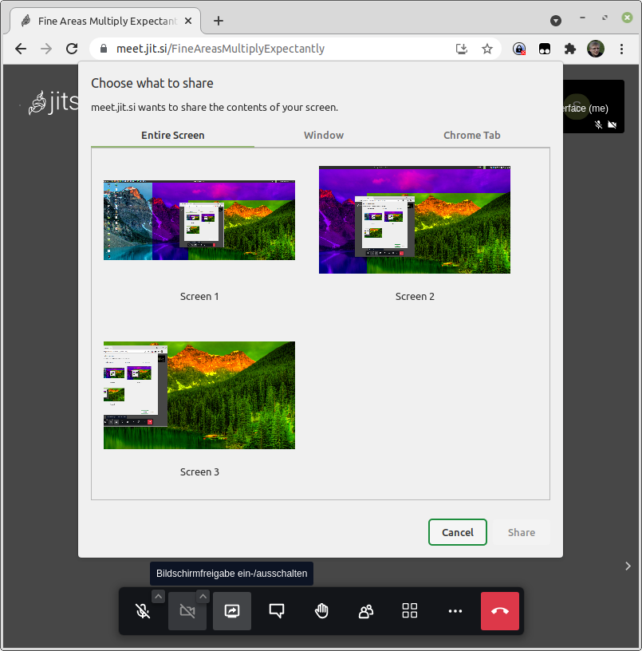

If you are using good ol' XServer, `xrandr` can be used to add new "monitors".
These monitors do not need to extend your screen, but instead can be overlaid over your existing screen.

<div>
    Size of display: <input type="number" value="3440" id="display_width" class="form-control resolution" step="10" min="1000">x<input type="number" value="1440" id="display_height" class="form-control resolution" step="10" min="500">
    <div class="form-inline">
    <label for="num_screens">Number of virtual screens: </label>
    <input type="number" value="2" id="num_screens" class="form-control resolution" max="6" min="1"><br>
    </div>
    Virtual screen sizes:
    <ul id="virtual_screen_settings">
    <li><input type="number" value="2560" class="form-control resolution" step="10">x<input type="number" value="1440" class="form-control resolution" step="10"></li>
    <li><input type="number" value="1920" class="form-control resolution" step="10">x<input type="number" value="1080" class="form-control resolution" step="10"></li>
    </ul><br>
    <canvas id="configurator_canvas" width="3440" height="1440"></canvas>
</div>

<div id="codeblock_setmonitor">
<button class="copy-to-clipboard"></button>
```text
function add_vscreens {
    xrandr --setmonitor 0_2560_1440 2560/2560x1440/0+880+0 none
    xrandr --setmonitor 1_1920_1080 1920/1920x1080/0+1520+360 none
}
```
</div>

If you want to, you can remove the virtual screens again:

<div id="codeblock_delmonitor">
<button class="copy-to-clipboard"></button>
```text
function del_vscreens {
    xrandr --delmonitor 0_2560_1440
    xrandr --delmonitor 1_1920_1080
}
```
</div>

You can add those lines to your `~/.zshrc` and add the screens by running `add_vscreens`.
Keep in mind that xrandr changes are temporary.
To persist the change, I recommend you to add the command `zsh -c ". ~/.zshrc; add_vscreens"`
to the "startup applications" of your desktop environment.

In your video conference software you can now select between the multiple screens.
To make choosing the right screen easier, feel free to use this desktop background:
(original by <a href="https://www.pexels.com/de-de/foto/see-und-berg-417074/" target="_blank">James Wheeler</a>)

<canvas id="wallpaper"></canvas>

Choose another background (not all sites allow downloading images, though):
<input class="form-control" id="wallpaper_url" value="https://images.pexels.com/photos/417074/pexels-photo-417074.jpeg"></input>

Here is how the result looks like in [Jitsi Meet](https://meet.jit.si/) with Chrome:


