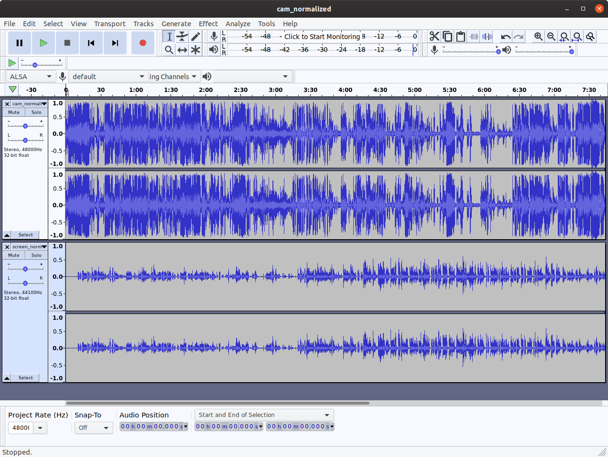
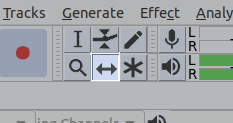
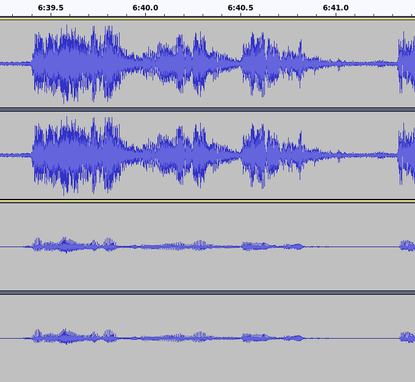
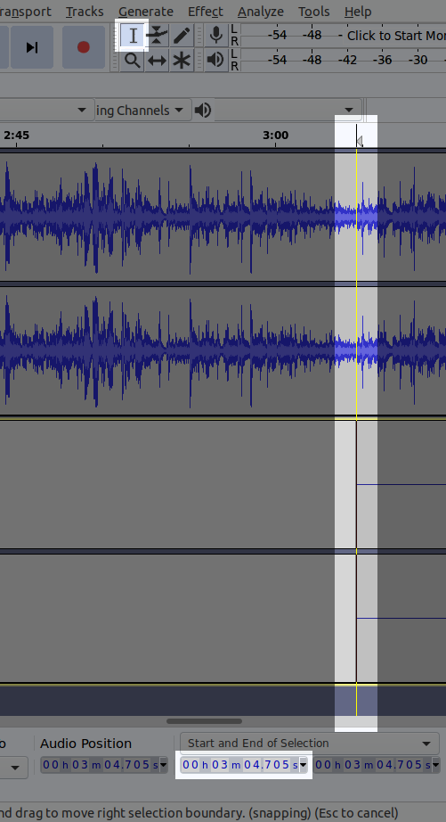
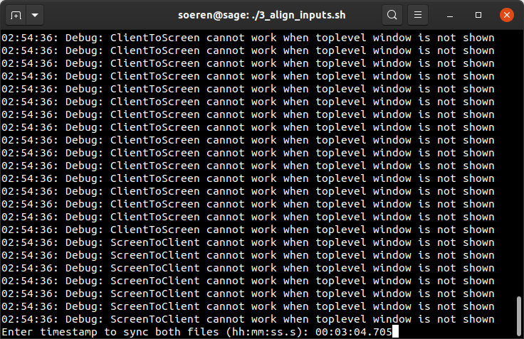
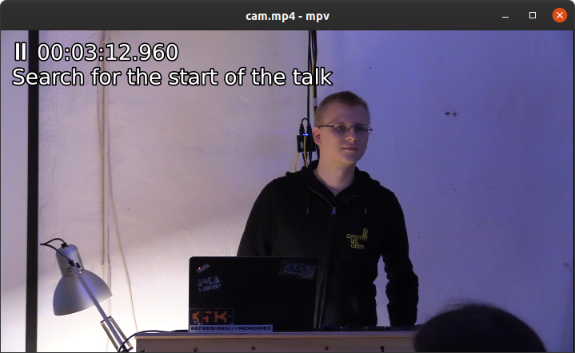
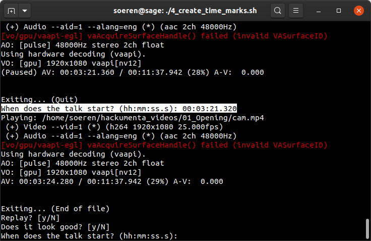
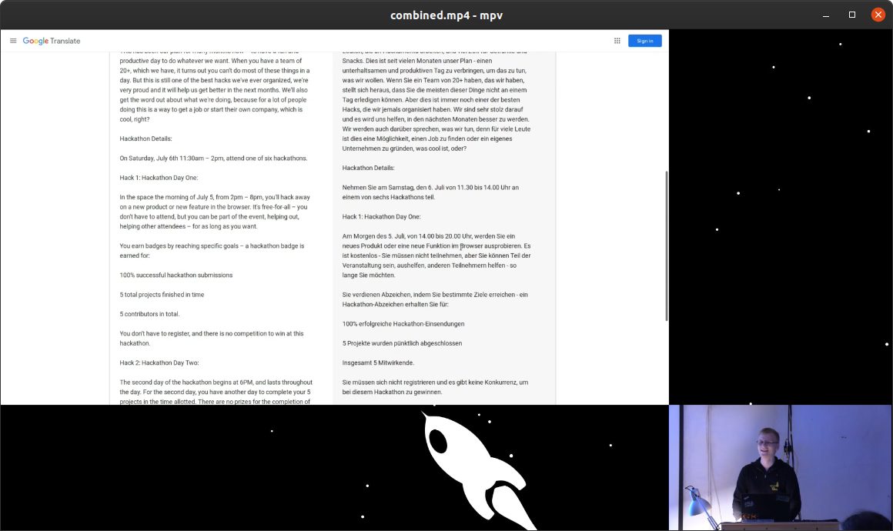

A while ago, we, the Chaos Computer Club Kassel, [flipdot e.V.](https://flipdot.org), organized a public
event, called the [hackumenta](https://2019.hackumenta.de/). Our talks were recorded and we wanted to
published them at [meda.ccc.de](https://media.ccc.de/c/hackumenta19). Speaker and slides were separately recorded and
need to be synced, merged, and cut, so I've created a little ffmpeg-toolchain.

This is the result:

<div style="height: 0; width: 100%; position: relative; padding-bottom: 56.25%; margin-bottom: 1em">
    <iframe
        width="100%"
        height="100%"
        src="https://media.ccc.de/v/hackumenta-23-opening/oembed"
        allowfullscreen
        style="position: absolute; border: 0">
    </iframe>
</div>

The final toolchain is available at
[github.com/flipdot/0xA-voc-toolchain](https://github.com/flipdot/0xA-voc-toolchain/) (subject to change).

It works by consecutively executing the numbered bash scripts. But first, set `INPUT_DIR` and
`WORKING_DIR` in [settings.env](https://github.com/flipdot/0xA-voc-toolchain/blob/master/settings.env).
Install all required packages:

```console
$ sudo apt install ffmpeg sox audacity mpv libxi-dev mesa-common-dev
$ nvm use 8
$ npm install -g https://github.com/transitive-bullshit/ffmpeg-concat.git#feature/optimize-frames
```

```console
$ git clone https://github.com/flipdot/0xA-voc-toolchain.git
$ cd 0xA-voc-toolchain
$ vim settings.env
$ ./1_preprocess_raw_files.sh
$ ./2_extract_audio.sh
$ ./3_align_inputs.sh
$ ./4_create_time_marks.sh
$ ./5_combine_videos.sh
$ ./6_add_intro_outro.sh
```

Each script will iterate through all directories inside `INPUT_DIR` / `WORKING_DIR` and execute commands
inside of them.

## 1. Preprocess raw files

Script: [`1_preprocess_raw_files.sh`](https://github.com/flipdot/0xA-voc-toolchain/blob/master/1_preprocess_raw_files.sh)

Let's begin by taking a look at our raw video material:

```text
INPUT_DIR
├── 01_Opening
│   ├── cam.MP4
│   ├── intro.mp4
│   ├── screen_raw.avi
│   └── title.txt
├── 02_CUDA_Basics
|   ├── cam_01.MP4
|   ├── cam_02.MP4
│   ├── intro.mp4
|   ├── screen_raw.avi
|   └── title.txt
├── background.mp4
└── outro.mp4
```

Due to our recording setup, we ended up with multiple "cam_xx.MP4" files, depending on the length of the
talk. Using `ffmpeg -f concat` together with a loop for the `-i` parameter allows us to combine all
`cam_xx.MP4` files into a single `cam.mp4`.

Also, the screen recordings were uncompressed.
`ffmpeg -hwaccel vaapi -vaapi_device /dev/dri/renderD128 -c:v h264_vaapi` allows us to efficiently re-encode
the recordings as H264.

Let's run the above commands by executing
[`1_preprocess_raw_files.sh`](https://github.com/flipdot/0xA-voc-toolchain/blob/master/1_preprocess_raw_files.sh).
It will produce these files:

```text
WORKING_DIR
├── 01_Opening
│   ├── cam.mp4
│   ├── intro.mp4
│   └── screen.mp4
├── 02_CUDA_Basics
│   ├── cam.mp4
│   ├── intro.mp4
│   └── screen.mp4
├── background.mp4
└── outro.mp4
```

## 2. Extract and normalize audio

Script: [`2_extract_audio.sh`](https://github.com/flipdot/0xA-voc-toolchain/blob/master/2_extract_audio.sh)

The cam- and screen recordings are not in sync and need manual adjustment. To do this adjustment, we first
need an audio file for each cam- and screen recording. By using `ffmpeg -vn`, we can remove the video track
(“video no”).

To improve the volume of the recordings, we utilize `sox`. It normalizes every audiofile:
`sox --norm $INPUT $OUTPUT`.

After executing [`2_extract_audio.sh`](https://github.com/flipdot/0xA-voc-toolchain/blob/master/2_extract_audio.sh),
we have two new files for each video in our working tree:

```text
WORKING_DIR
├── 01_Opening
│   ├── cam_normalized.wav
│   ├── screen_normalized.wav
│   └── ...
└── 02_CUDA_Basics
    ├── cam_normalized.wav
    ├── screen_normalized.wav
    └── ...
```

## 3. Align cam and screen recording

Script: [`3_align_inputs.sh`](https://github.com/flipdot/0xA-voc-toolchain/blob/master/3_align_inputs.sh)

The manual adjustment of cam- and screen recording will be assisted by this script. It will start audacity
for every talk, opening both wav-files in a single audacity project:



In the upper track you can see the waveform of the cam recording, in the lower track the waveform of the
screen recording. Select the “Time Shift Tool” by pressing <kbd>F5</kbd> or clicking on this button:



Now, move the lower track with your cursor until it is aligned with upper track. Pay attention to strong
peaks in the waveform, they make the alignment more easy. Playing both files and listening to the audio
helps confirming a correct adjustment.



After aligning the tracks, you need to determine the offset. To do so, pick the “Selection Tool” by
pressing <kbd>F1</kbd>, and click on the left edge of the second track. In the lower section of audacity,
the offset is printed below the ”Start and End of Selection” label.



Keep this timestamp in mind and close audacity. In your terminal, the script now prompts you for this
timestamp. Enter it.



The timestamp you entered will be validated by a regular expression and saved to a text file:

```text
WORKING_DIR
├── 01_Opening
│   ├── screen_offset.txt
│   └── ...
└── 02_CUDA_Basics
    ├── screen_offset.txt
    └── ...
```

## 4. Search for start and end of the talk

Script: [`4_create_time_marks.sh`](https://github.com/flipdot/0xA-voc-toolchain/blob/master/4_create_time_marks.sh)

A bit more manual work is required. Between the start of the recording and the beginning of the talk are
a couple of minutes that need to be removed. This script opens mpv with a timestamp in the OSD and asks
you to search for the start of the talk.

These are useful hotkeys for mpv:

- <kbd>,</kbd> – One frame backward
- <kbd>.</kbd> – One frame forward
- <kbd>[</kbd> – Decrease playback speed
- <kbd>]</kbd> – Increase playback speed



After you found the timestamp, close mpv. Once again, you will be asked to enter that timestamp. After
you entered it, mpv will open again - but it will start playing from the timestamp you entered. This
allows you to make sure that the timestamp is set correctly and no words are cut off.



The same procedure will be repeated for the end of the talk to get both timestamps. After you are done
with all talks, your working directory will look like this:

```text
WORKING_DIR
├── 01_Opening
│   ├── talk_end.txt
│   ├── talk_start.txt
│   └── ...
└── 02_CUDA_Basics
    ├── talk_end.txt
    ├── talk_start.txt
    └── ...
```

## 5. Create a splitscreen of both videos

Script: [`5_combine_videos.sh`](https://github.com/flipdot/0xA-voc-toolchain/blob/master/5_combine_videos.sh)

With the timemarks inside our textfiles, we can now generate a splitscreen with both the cam and the
screen recording, synchronized. We will also add a background animation, which was copied earlier from
`$INPUT_DIR/background.mp4` to `$WORKING_DIR/background.mp4`.

In our case, we had one more issue with our recording setup: The audio embedded in the screen recording
is not in-sync with the video of the screen recording. It has a constant delay of about 500ms. We can
fix that by using `ffmpeg -itsoffset $SCREEN_AUDIO_OFFSET`. The offset variable is defined inside
`settings.env`.

Execute `./5_combine_videos.sh` and lean back. Your working directory will contain a new file `combined.mp4`:

```text
WORKING_DIR
├── 01_Opening
│   ├── combined.mp4
│   └── ...
└── 02_CUDA_Basics
    ├── combined.mp4
    └── ...
```

And it will look like this:



## 6. Add intro and outro

Script: [`6_add_intro_outro.sh`](https://github.com/flipdot/0xA-voc-toolchain/blob/master/6_add_intro_outro.sh)

To finalize the video, we want to concat an intro and an outro to each file. FFmpeg filter graphs are
very powerful, but it is pretty difficult to create simple transitions with them. Therefore, we will
be using [ffmpeg-concat](https://github.com/transitive-bullshit/ffmpeg-concat) for this task. We need
to use the `features/optimize-frames` branch - otherwise, tons of gigabytes will be consumed in our
`/tmp` directory. Checkout this [pull request](https://github.com/transitive-bullshit/ffmpeg-concat/pull/23) –
if it was merged, you can use the master version.

`ffmpeg-concat` also does not keep the audio of the inputs
([issue #4](https://github.com/transitive-bullshit/ffmpeg-concat/issues/4)). We work around this by
calling `ffmpeg` yet another time after concatenation, copying back our audio stream. Fortunately,
this does not require de- and encoding of the video. We will also add an `intro.wav`, so we will
get a fancy intro sound. This requires re-encoding of the audio, but compared to video-encoding
this is quite fast.

And there you have it – a final `output.mp4` consisting of the intro, talk with cam and screen recording,
and outro.

The talks are available at [media.ccc.de/c/hackumenta19](https://media.ccc.de/c/hackumenta19).